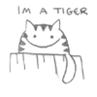

# Game Development Summer Camp 2018

This is the workshop material created for Pink Programming's first GameDev camp, which was held 2018 July 16-21 in Järvsö. 

The workshop targeted beginners in programming. It made heavy use of the open source game programming tool called [Greenfoot](https://www.greenfoot.org), developed at Kings' Collage London with support from Oracle. It is free software released under GPL license, for Windows, Mac, Linux or any recent JVM. 

## Contents 

### Greenfoot

* Installer files, version 3.1, used for workshops
* Greenfoot API docs, offline version
* Greenfoot programmer's tutorial

### Text Game Example

#### Workshop material

* [Introduction slides](Workshop_short-story-text-game_slides.pdf)
* [Workshop walkthrough](Workshop_short-story-text-game_tutorial.pdf), version 1.0 - 1.3
* Greenfoot project files, version 1.0 - 1.4

